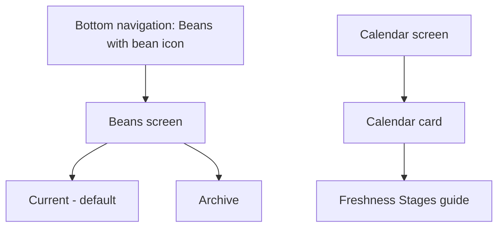
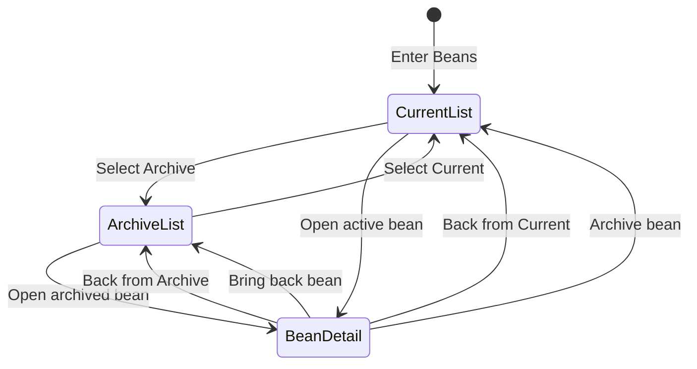

# Beans Navigation and Freshness Layout - Plan

## Goal Capsule

- **Objective:** Make active and archived beans easier to browse while placing freshness guidance beside the calendar it explains.
- **Product authority:** The quiet segmented layout is the selected direction for this personal, mobile-first workflow.
- **Authority order:** Product Contract, existing Coffee Journal interaction patterns, then the smallest implementation that satisfies both.
- **Execution profile:** Localized code change in the zero-build Alpine application, protected by browser and integration tests.
- **Stop conditions:** Stop if implementation requires persistence changes, alters freshness calculations, or contradicts the confirmed collection-return behavior.
- **Tail ownership:** LFG owns implementation, verification, review, pull-request creation, and CI follow-through.
- **Open blockers:** None.

## Product Contract

### Summary

Rename the Coffee tab to Beans, give it a coffee-bean icon, and separate Current and Archive into sibling views.
Move the Freshness Stages guide from the Beans list to a supporting section beneath the Calendar card.

### Key Decisions

- **Quiet segmented navigation:** Current and Archive use a two-option segmented control because both are first-class bean collections without needing another drill-in screen.
- **Current-first entry:** Opening Beans selects Current by default, while returning from a bean detail preserves the collection the user came from.
- **Archive context replaces status chrome:** Archive cards use their normal visual treatment without an Archived badge because the selected collection already communicates their state.
- **Origin-preserving collection actions:** Archiving returns to Current and restoring returns to Archive, with the moved bean removed from the originating list.
- **Contextual freshness guidance:** The three-stage guide always sits below the Calendar card as its own section so the reference remains available even before a bean is added.

### Requirements

**Navigation identity**

- R1. The bottom navigation label must read `Beans` instead of `Coffee`.
- R2. The Beans navigation item must use a recognizable coffee-bean icon that follows the size and active-state treatment of the other tab icons.

**Bean browsing**

- R3. The Beans list must expose Current and Archive through the quiet two-option segmented control shown in the selected layout direction.
- R4. Current must show only active beans, and Archive must show the complete archived-bean list.
- R5. The inline archived-bean preview and its View All action must be removed from Current.
- R6. Opening the Beans tab from another primary tab must select Current, regardless of the collection selected during the previous visit.
- R7. Opening a bean and returning to the list must restore the Current or Archive collection from which the bean was opened.
- R8. Each collection must retain an appropriate empty state, with Add Bean as the only action in an empty Current collection.

**Freshness guidance**

- R9. The Freshness Stages guide must be removed from the Beans list.
- R10. The same three-stage guide must always appear as a separate section directly beneath the Calendar card.
- R11. The moved guide must retain the existing Resting, At Peak, and Past Peak thresholds, labels, colors, and explanatory text.
- R12. The Calendar tab must avoid repeating the existing one-line peak-window note once the full guide is present.

**Collection state and treatment**

- R13. Archive bean cards must use normal card styling without an Archived badge.
- R14. Archiving a bean from its detail must return to Current with that bean removed from the collection.
- R15. Bringing back a bean from its detail must return to Archive with that bean removed from the collection.

### Key Flows

- F1. Browse a bean collection
  - **Trigger:** The user opens Beans from the bottom navigation.
  - **Steps:** Current opens by default; the user may switch to Archive; selecting a bean opens its detail; Back returns to the originating collection; archiving or restoring returns to the collection where the action began.
  - **Outcome:** Active and archived beans remain separate but equally accessible.
  - **Covered by:** R1-R8, R13-R15.
- F2. Interpret the freshness calendar
  - **Trigger:** The user opens Calendar.
  - **Steps:** The user scans the calendar card, then reads the Freshness Stages guide immediately below it.
  - **Outcome:** Freshness timing is explained where its ranges are visualized.
  - **Covered by:** R9-R12.

### Acceptance Examples

- AE1. **Covers R3-R7.** Given the user enters Beans from another primary tab, Current is selected; after the user switches to Archive, opens an archived bean, and returns, Archive remains selected.
- AE2. **Covers R4 and R8.** Given there are archived beans but no active beans, Current offers Add Bean in its empty state and Archive remains available through the segmented control.
- AE3. **Covers R9-R12.** Given no beans exist, Beans contains no Freshness Stages guide and Calendar still shows the full guide below the calendar card without the redundant peak-window note.
- AE4. **Covers R13.** Given the user opens Archive, archived beans use normal card styling and do not repeat their status with an Archived badge.
- AE5. **Covers R14-R15.** Given a bean changes collection from its detail, the app returns to the originating collection and the moved bean is no longer listed there.

### Scope Boundaries

- Do not change freshness thresholds, stage meanings, bean sorting, or freshness calculations.
- Do not change archive, restore, add, edit, or delete semantics beyond the confirmed collection-return behavior and navigation needed to expose Current and Archive as sibling views.
- Do not redesign bean cards, bean details, the Calendar visualization, or the other primary tabs.

---

## Planning Contract

### Product Contract Preservation

Product Contract unchanged.

### Key Technical Decisions

- **KTD1 - Separate collection selection from screen mode:** Keep the existing Beans list/detail/form state and add a small Current/Archive selection state. This preserves form and detail behavior while allowing Back to restore the originating collection.
- **KTD2 - Reset only at primary-tab entry:** Entering Beans through primary navigation resets the collection to Current. Opening detail preserves the collection, while archive and restore actions explicitly return to their confirmed originating collections.
- **KTD3 - Use native segmented controls:** Render Current and Archive as buttons with tab semantics, selected-state attributes, keyboard focus treatment, and the existing design tokens. No reusable component abstraction is warranted for one two-option control.
- **KTD4 - Use an inline bean icon:** Replace the sprout character with a small `currentColor` SVG coffee bean inside the existing navigation icon wrapper so active, hover, and inactive colors continue to come from the tab button.
- **KTD5 - Move, do not duplicate, freshness guidance:** Reuse the existing stage copy and color classes below the Calendar card, then remove the short peak-window note and the Beans-list instance.

### Assumptions

- The Add Bean action is available only from Current so saving a new active bean cannot return the user to Archive with the new bean hidden; the confirmed empty Current state adds no restore shortcut.
- Bean ordering, occurrence markers, ratings, roast dates, and freshness badges retain their current behavior within the applicable collection.
- The new Archive view replaces the old archive drill-in without introducing persistence, routing, or migration work.

### State Flow

### Sequencing

Implement the collection state and Beans markup first because the archive/restore transitions depend on it. Move the freshness guide after the list state is stable, then run the full browser-backed suite across both units.

---

## Implementation Units

### U1. Beans navigation identity and collection state

- **Goal:** Replace the Coffee/sprout navigation identity and convert Current and Archive into sibling segmented views with the confirmed state transitions.
- **Requirements:** R1-R8, R13-R15; F1; AE1, AE2, AE4, AE5.
- **Dependencies:** None.
- **Files:** `index.html`, `tests/smoke.spec.js`, `test-e2e.html`.
- **Approach:** Add an independent Current/Archive selection to the Alpine app state while retaining the existing list/detail/form mode. Render one Beans heading and segmented control for the list mode, conditionally show the active or complete archived collection, retire the archive preview and drill-in view, and remove archived-card dimming and badges. Update primary-tab activation, the Today empty-state View All Archive entry point, Back, archive, and restore transitions to follow KTD1-KTD3. Keep Add Bean actions on Current so new active beans return to a collection that can display them. Replace the bottom-navigation label and sprout with the inline bean icon from KTD4.
- **Patterns to follow:** Existing `activateTab`, `selectBean`, `archiveBean`, and `unarchiveBean` state transitions in `index.html`; existing tab-button color inheritance and focus patterns; current `currentBeans` and `archivedBeans` computed collections.
- **Test scenarios:**
  - Covers AE1. Entering Beans from Today selects Current; switching to Archive, opening a bean, and pressing Back restores Archive.
  - Leaving Beans while Archive is selected and returning through primary navigation selects Current.
  - Covers AE2. With archived beans and no active beans, Current shows its Add Bean empty state while Archive remains reachable.
  - With no archived beans, Archive shows its dedicated empty state and no bean cards.
  - Covers AE4. Archive shows every archived bean with normal card styling and no Archived badge.
  - Covers AE5. Archiving an active bean returns to Current without that bean; bringing back an archived bean returns to Archive without that bean.
  - The Today empty-state View All Archive action opens Beans with Archive selected after the old archive drill-in is removed.
  - Add Bean is available on Current and hidden on Archive so saving a new active bean cannot return to a collection that excludes it.
  - The segmented buttons expose tab semantics and selected state, and keyboard focus can move between them without losing the active collection.
  - The bottom navigation exposes the Beans label and a coffee-bean SVG while retaining the active-state color treatment.
- **Verification:** The collection switch, detail return paths, membership-changing actions, empty state, label, and icon behave correctly in a mobile viewport with no Alpine runtime errors.

### U2. Calendar freshness guidance relocation

- **Goal:** Move the complete Freshness Stages reference beneath the Calendar card and remove redundant guidance from Beans and Calendar.
- **Requirements:** R9-R12; F2; AE3.
- **Dependencies:** U1.
- **Files:** `index.html`, `tests/smoke.spec.js`.
- **Approach:** Remove the Beans-list guide, place the existing three-stage content in a separate Calendar-aligned section after the card, and reuse its current colors and typography. Render it unconditionally, and remove the Calendar card's one-line peak-window note.
- **Patterns to follow:** Existing freshness legend markup and design tokens in `index.html`; existing Calendar card width and spacing conventions.
- **Test scenarios:**
  - Covers AE3. With empty storage, Calendar still shows one complete three-stage guide below the card and no one-line peak-window note.
  - Beans contains no Freshness Stages guide for active, archived-only, or empty data.
  - The guide retains Resting 0-6 days, At Peak 7-21 days, Past Peak 22+ days, and the existing explanatory copy.
  - Calendar filtering, empty state, and month navigation remain unchanged.
- **Verification:** Calendar presents a single always-visible guide outside the card, and no duplicate guide or peak-window note remains elsewhere.

---

## Verification Contract

- **Focused browser regression:** `npm run test:smoke` proves navigation identity, collection switching, state transitions, empty states, archive-card treatment, and freshness-guide placement.
- **Full regression suite:** `npm test` runs the Playwright smoke coverage plus the embedded `tests.html` and `test-e2e.html` suites.
- **Static diff hygiene:** `git diff --check` reports no whitespace errors.
- **Browser quality gate:** Verify the affected Beans and Calendar flows at the app's mobile width, including no console or page errors and no tab-swipe regression.

---

## Definition of Done

- U1 is complete when R1-R8 and R13-R15 pass their listed browser and integration scenarios.
- U2 is complete when R9-R12 pass their listed browser scenarios with the guide visible even on empty storage.
- The full regression suite and static diff hygiene gates pass.
- No duplicate Archive drill-in, archived preview, freshness guide, or peak-window note remains in the active UI.
- No persistence schema, freshness calculation, bean sorting, or unrelated tab behavior changes.
- Experimental or abandoned implementation code is removed from the final diff.
