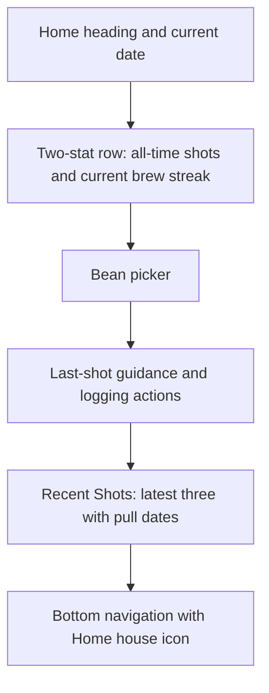
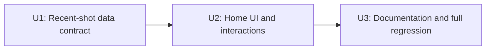

# Home Dashboard - Plan

## Goal Capsule

- **Objective:** Turn Today into a useful Home screen that shows recent brewing context and a small personal snapshot without competing with shot logging.
- **Product authority:** The user-confirmed Home direction from July 5, 2026, together with the current Coffee Journal Today and Stats behavior.
- **Open blockers:** None.
- **Execution profile:** Implement the derived state and regression coverage first, then update the Home presentation and documentation.
- **Stop conditions:** Pause if the work would change shot persistence, redefine the confirmed streak behavior, add homepage stats, or require a new history surface.
- **Tail ownership:** The executor owns implementation, cleanup, focused browser checks, and the full repository test suite; publishing remains a separate user decision.

---

## Product Contract

### Summary

Rename Today to Home and give it a house icon. When an active bean exists, place all-time shots and the current brew streak at the top, retain the existing brewing workflow below, and replace Today's Shots with the three most recent shots and their pull dates.

### Problem Frame

The current Today list disappears with the calendar day, so returning after a day or longer does not answer a basic question: what was pulled most recently, and when? The separate Stats tab contains useful personal data, but the primary screen offers no small sense of accumulated activity when the app opens.

### Key Decisions

- **Home remains brewing-first:** The stats summary sits above the bean workflow, but it is limited to two values so selecting a bean and logging a shot remain the screen's primary jobs.
- **Recent replaces today-only:** Home shows the latest three shots across all beans instead of limiting the list to the current date.
- **The streak is literal:** Current streak counts consecutive brew days ending today or yesterday. If neither day has a shot, Home displays `0 days`.
- **Stats stays the deeper analysis surface:** Home does not absorb charts, recaps, rankings, or additional aggregate metrics from Stats.

### Layout Direction

### Requirements

**Navigation identity**

- R1. The primary navigation label must read `Home` instead of `Today`.
- R2. The Home navigation item must use a recognizable house icon that follows the size and active-state treatment of the other navigation icons.

**Homepage stats**

- R3. When at least one active bean exists, Home must show a two-item stats row after the page date and before the bean-selection workflow.
- R4. The stats row must contain only all-time shots and current brew streak.
- R5. All-time shots must count every logged shot, regardless of bean or pull date.
- R6. Current brew streak must count consecutive calendar days with at least one shot, ending today or yesterday.
- R7. Multiple shots on the same pull date must count as one brew day for the streak.
- R8. Current brew streak must display `0 days` when the most recent brew day is earlier than yesterday.
- R9. Stats must update when shots are added, edited, backdated, or deleted.

**Brewing workflow**

- R10. Home must retain the current bean picker, last-shot guidance, Log Shot action, and conditional Shot History action.
- R11. The last-shot guidance must continue to show the source shot's pull date.

**Recent shots**

- R12. `Recent Shots` must replace the `Today's Shots` section.
- R13. Recent Shots must show at most the latest three shots across all beans, ordered newest first by pull date.
- R14. Every recent shot must show a clear pull date in addition to its existing bean, recipe, quality, note, and portafilter information when available.
- R15. Existing edit and delete interactions on Home shot cards must remain available.
- R16. When active beans exist but no shots have been logged, Home must show a quiet logging-oriented empty state instead of empty recent-shot cards.

### Key Flows

- F1. Returning after a gap
  - **Trigger:** The user has an active bean and opens Home after one or more days away.
  - **Steps:** Home shows the two stats, the current date, and the three latest shots with their pull dates; the user can then select a bean and reference its last-shot guidance.
  - **Outcome:** The user can tell what they pulled last and when without navigating elsewhere.
  - **Covered by:** R3-R14
- F2. Logging the next shot
  - **Trigger:** The user selects a bean and logs a shot from Home.
  - **Steps:** The shot is saved, Recent Shots reorders by pull date, and all-time shots and the current streak refresh.
  - **Outcome:** Home reflects the new activity immediately.
  - **Covered by:** R5-R10, R12-R15
- F3. Reviewing and correcting a recent shot
  - **Trigger:** The user opens or deletes one of the three recent shot cards.
  - **Steps:** Existing shot editing or deletion behavior runs, then the recent list and stats refresh.
  - **Outcome:** Home remains consistent with the underlying journal.
  - **Covered by:** R9, R13-R15

### Acceptance Examples

- AE1. **Covers R6-R8.** Given shots on today and each of the previous two calendar days, Home shows a current brew streak of `3 days`.
- AE2. **Covers R6 and R8.** Given the newest shot was pulled two days ago, Home shows a current brew streak of `0 days`.
- AE3. **Covers R6 and R7.** Given three shots today and one shot yesterday, Home shows a current brew streak of `2 days`.
- AE4. **Covers R9.** Given a shot is backdated into or out of the current run, Home recalculates the streak from the edited pull date.
- AE5. **Covers R12-R14.** Given shots across four different dates and beans, Home shows the newest three only, each with its own pull date.
- AE6. **Covers R5, R8, and R16.** Given active beans exist but no shots have been logged, Home shows `0` all-time shots, `0 days`, and a logging-oriented empty state.

### Success Criteria

- A returning user can identify the latest three shots and when each was pulled directly from Home.
- With an active bean, the two stats are visible on entry without pushing the bean workflow out of the primary screen hierarchy.
- Shot mutations keep the stats and recent list accurate without requiring a reload.
- Existing bean-selection, shot-history, editing, deletion, and logging behavior continues to work.

### Scope Boundaries

- Do not add a full cross-bean activity timeline or a new all-shot-history screen.
- Do not add more homepage stats, charts, rankings, monthly recaps, or other Stats-tab content.
- Do not add goals, badges, streak reminders, record celebrations, or other motivational mechanics.
- Do not remove or repurpose the Stats tab.
- Do not redesign the existing no-active-bean add-or-restore empty state beyond any copy required by the Home rename.
- Do not change shot, bean, or portafilter data semantics for this feature.

### Dependencies and Assumptions

- The screen remains optimized for the single user of this personal journal.
- Pull-date behavior continues to use a shot's recorded pull date, with legacy records remaining countable through their existing recorded-date fallback.
- The existing Stats calculations are the authority for all-time shots and current brew streak semantics.
- The current Today workflow and shot-card interactions remain the behavioral baseline for Home.

### Sources

- `index.html` — current Today layout, recent-shot cards, last-shot guidance, navigation, and Stats calculations.
- `brainstorms/2026-05-22-shot-stats-spec.md` — shot-count definitions and read-only stats boundaries.
- `brainstorms/2026-06-09-wrapped-stats-spec.md` — current brew-run semantics and the informational-not-motivational stats direction.
- `brainstorms/2026-06-22-today-view-shot-history-brainstorm.md` — prior decision to keep nearby history accessible without duplicating the bean-detail history surface.

---

## Planning Contract

**Product Contract preservation:** Clarified Summary, F1, F2, and Success Criteria wording to match R3, R13, and the confirmed no-active-bean boundary; requirements and scope are unchanged.

### Key Technical Decisions

- **KTD1 — Preserve the internal tab contract:** Keep the `today` tab key and existing daily-flow method/state names. Change user-facing Home copy and iconography without a broad internal rename that would add risk but no product value.
- **KTD2 — Reuse the Stats authority:** Render Home's two values from the existing all-time shot count and current brew-run calculations. Do not add persistence, duplicate calculations, or a homepage-specific stats engine.
- **KTD3 — Derive one immutable recent-shot projection:** Replace the today-only projection with a newest-first three-shot projection that uses pull date as the primary sort, recorded timestamp as the tie-breaker, and the existing legacy-date fallback.
- **KTD4 — Reuse shot-card behavior:** Keep the existing Home card markup, edit action, swipe-to-delete behavior, recipe details, quality treatment, notes, assessment visualization, and portafilter label. Add the pull date and change the collection source instead of creating a second card component.
- **KTD5 — Isolate the two-column stats layout:** Reuse the existing Stats value and label treatment inside a Home-specific two-column wrapper so the three-column Stats card remains unchanged.
- **KTD6 — Test behavior at its owning layer:** Keep existing pure-function coverage for brew-run semantics, add app-state coverage for the recent-shot projection, and use browser coverage for Home layout, navigation identity, empty states, and preserved interactions.

### Implementation Constraints

- Keep the app zero-build and dependency-free at runtime.
- Keep all feature code within the existing Alpine application in `index.html`.
- Treat all Home stats as derived read-only values.
- Preserve the no-active-bean add-or-restore flow and the existing overlay/swipe blocking behavior.
- Do not rename historical brainstorms, archived plans, or old decision records that correctly describe the product at the time they were written.

### Sequencing

### Research Grounding

- `index.html` already exposes reactive `statsTotalShots` and `statsBrewDayRuns.current` values backed by the Stats pure functions.
- `tests.html` already covers empty, active, expired, multi-shot-day, backdated, and legacy-fallback brew runs, so the plan does not duplicate those scenarios in a new helper suite.
- `test-e2e.html` owns Alpine state and rendered-DOM integration checks, while `tests/smoke.spec.js` owns real-browser navigation, layout, and interaction regressions.
- The visible Today label is independent from the `today` key in `TAB_ORDER`, so the product rename does not require changing swipe adjacency or persisted state.
- External research is unnecessary because the feature extends established local patterns and introduces no external API, dependency, security boundary, or persistence change.

---

## Implementation Units

### U1. Establish the recent-shot data contract

- **Goal:** Replace the today-only shot projection with a reactive, stable latest-three projection while retaining the existing Stats calculations.
- **Requirements:** R5-R9, R12-R14; F1-F3; AE1-AE5.
- **Dependencies:** None.
- **Files:** `index.html`, `test-e2e.html`.
- **Approach:** Add a `recentShots` computed projection over the shot collection. Sort by normalized pull date, break equal-date ties with the recorded timestamp and existing insertion-order convention, return at most three entries, and leave the source collection untouched. Remove the obsolete `todayShots` projection and update its focused integration coverage. Continue to read all-time shots and current streak from the established Stats getters.
- **Execution note:** Start by replacing the today-only integration check with failing recent-shot ordering, limit, empty-state, and legacy-date scenarios. Do not duplicate the already-complete brew-run unit suite.
- **Test scenarios:**
  - Four shots across multiple beans and pull dates return only the newest three in descending pull-date order.
  - Two shots on the same pull date use recorded time to place the later-recorded shot first, with insertion order providing a stable final tie-breaker.
  - A legacy shot without a pull date participates using its recorded-date fallback.
  - An empty shot collection returns an empty recent list while all-time shots and current streak remain zero.
  - Backdating an edited shot changes its recent-list position and recalculates the current streak.
  - Deleting a recent shot promotes the next eligible shot and decrements all-time shots without stale state.
- **Verification:** App-state tests prove ordering, limit, fallback, and reactive mutation behavior without changing the existing Stats-tab results.

### U2. Build the Home presentation and preserve its workflows

- **Goal:** Deliver the confirmed stats-first Home hierarchy, navigation identity, and dated Recent Shots list without regressing daily logging or shot-card actions.
- **Requirements:** R1-R16; F1-F3; AE1-AE6.
- **Dependencies:** U1.
- **Files:** `index.html`, `test-e2e.html`, `tests/smoke.spec.js`.
- **Approach:** Replace the visible Today navigation label with Home and use an aria-hidden `currentColor` house SVG inside the established icon wrapper. Add the confirmed Home page heading alongside the current date and Backup action. Add a two-column stats row after the date header, formatting the streak as singular or plural and preserving the confirmed `0 days` state. Point the existing shot-card loop at `recentShots`, rename its heading, and display each pull date through the established date formatter. Base the active-bean empty state on the recent list rather than bean selection so it remains accurate after choosing an unlogged bean. Keep the internal tab key, bean picker, guidance card, history action, edit action, swipe deletion, and no-active-bean branch unchanged.
- **Execution note:** Add the DOM assertions before changing markup, then keep selectors narrow with Home-specific test IDs rather than binding tests to incidental layout structure.
- **Test scenarios:**
  - The bottom navigation exposes Home with a visible house icon, no visible Today navigation label, and the same tab activation/swipe behavior.
  - The normal Home state renders the Home page heading, current date, and Backup action without overlap.
  - With active beans and no shots, the two stats read `0` and `0 days`, and the quiet logging-oriented empty state appears.
  - Selecting an active bean with no shots keeps that empty state visible below its app-default guidance.
  - With shots today and yesterday, Home shows the correct all-time total and pluralized current streak above the bean picker.
  - A one-day streak uses the singular `1 day`; a run older than yesterday displays `0 days`.
  - Recent Shots renders three cross-bean cards with distinct pull dates and excludes the fourth-newest card.
  - Opening a recent card still edits that shot, and deleting one still uses the existing confirmation/swipe behavior before refreshing stats and the list.
  - Selecting a bean still shows last-shot guidance with its date, keeps Log Shot primary, and exposes Shot History only at the existing threshold.
  - With no active beans, the current add-or-restore screen remains reachable and its archive navigation still works.
  - On a mobile viewport, both stat cards remain in one readable row without clipping, and recent cards retain usable edit and swipe targets.
- **Verification:** Integration and browser checks prove the Home hierarchy, values, dates, empty states, responsive row, and preserved actions with no runtime errors.

### U3. Align active documentation and run the regression tail

- **Goal:** Make active user and developer documentation describe Home accurately, then prove the feature against the full repository suite.
- **Requirements:** R1-R16 and all Success Criteria.
- **Dependencies:** U2.
- **Files:** `README.md`, `AGENTS.md`, `CLAUDE.md`.
- **Approach:** Update current documentation from the Today-only description to the Home dashboard behavior, including the visible Home name, recent-shot projection, two homepage stats, and the intentional internal `today` key. Leave historical decision records untouched. Run the existing unit page, integration page, and browser suite together; remove obsolete Today-only assertions and any abandoned styling or selectors from earlier attempts.
- **Test scenarios:**
  - Active documentation consistently describes Home while distinguishing visible naming from retained internal daily-flow identifiers.
  - The pure brew-run suite remains green without semantic changes.
  - Existing Beans, Calendar, Stats, backup, portafilter, tab-swipe, shot-form, shot-history, edit, and delete regressions remain green.
  - A repository search finds no active user-facing `Today's Shots` heading or Today navigation label, while intentional internal identifiers and historical records remain.
- **Verification:** Documentation matches shipped behavior, the focused smoke suite passes, the full suite passes, and the final diff contains no whitespace errors or abandoned code.

---

## Verification Contract

| Gate | Command or check | Proves |
|---|---|---|
| Focused browser regression | `npm run test:smoke` | Home navigation, stats row, Recent Shots rendering, responsive layout, preserved workflows, and zero browser runtime errors. |
| Full automated suite | `npm test` | Playwright smoke coverage plus the `tests.html` unit suite and `test-e2e.html` integration suite. |
| Static diff check | `git diff --check` | No whitespace errors in the implementation or documentation diff. |
| Manual mobile review | Serve the app and inspect Home at a narrow mobile width. | The two stats remain readable, recent dates scan quickly, and touch targets remain usable. |

The feature does not require a migration, network check, release validation step, or new browser dependency.

---

## Definition of Done

- The artifact remains faithful to the unchanged Product Contract and all R/F/AE references are covered by an implementation unit or verification gate.
- U1 proves the recent-shot projection, three-item limit, pull-date ordering, stable ties, legacy fallback, and reactive mutations.
- U2 delivers the Home label, house icon, two top stats, preserved brewing workflow, and dated Recent Shots list across normal and empty states.
- U3 updates active documentation and completes the focused and full regression tail.
- `npm run test:smoke`, `npm test`, and `git diff --check` pass.
- No new persisted field, runtime dependency, all-shot-history surface, homepage metric, or motivational mechanic is introduced.
- The Stats tab and current no-active-bean restore flow remain unchanged.
- Dead selectors, obsolete Today-only assertions, and code from abandoned approaches are removed before handoff.
